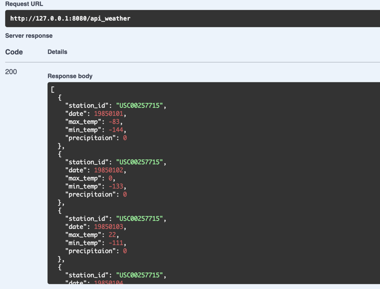
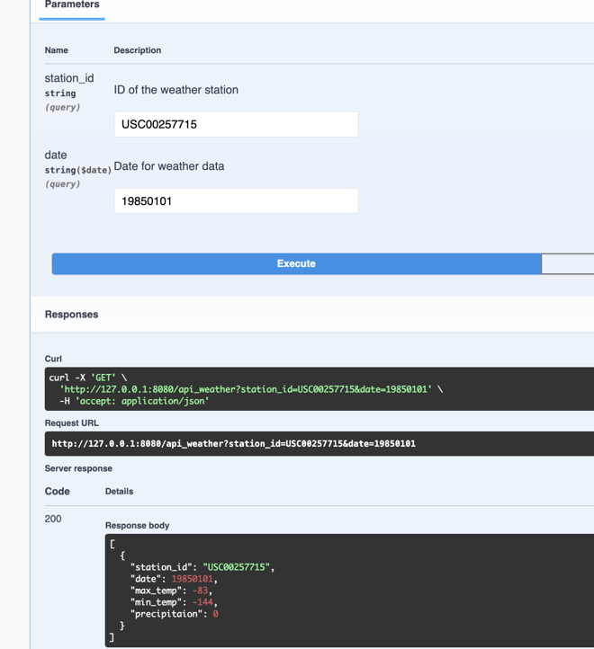
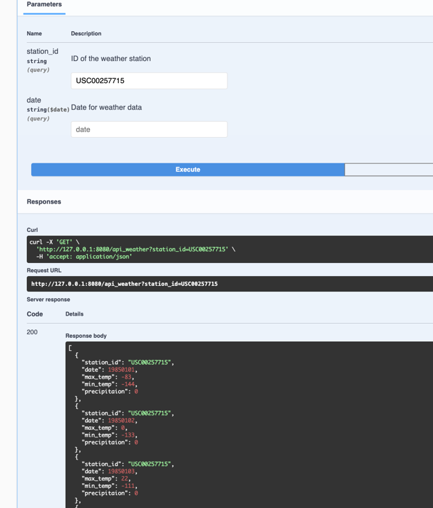
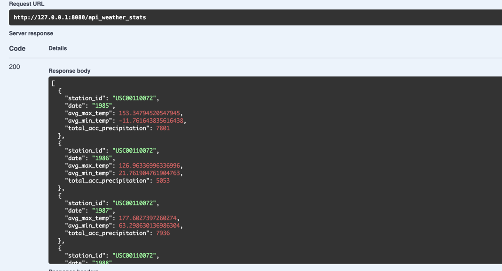
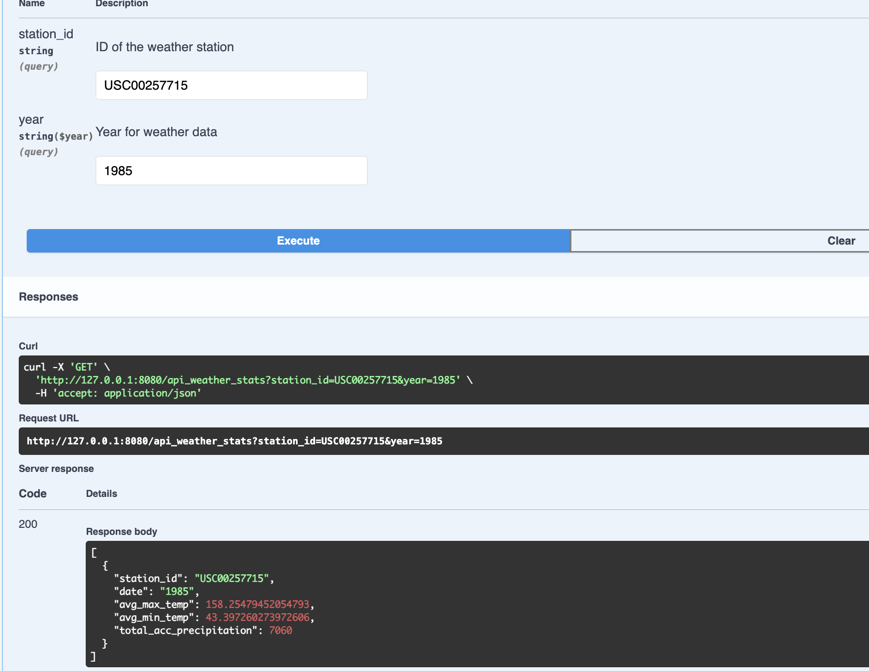

# Weather API with CherryPy
 This is a CherryPy-based Weather API that provides weather data to users. It includes instructions on how to set up a virtual environment, install the required dependencies, and ingest data. Additionally, it offers information on how to access and use the API.

The API endpoints provide access to the following functionalities:

    /api_weather - retrieves weather data
    /api_weather_stats - provides statistics about the data
    /docs - provides documentation using openapi

## Prerequisites

The following prerequisites are required to use this API:

    Python (3.7 or higher)
    Virtualenv
    SQLite (or PostgreSQL if deploying to AWS)
    AWS account (if deploying to AWS)

## Installation and Usage

### To install the required dependencies, create and activate a virtual environment with the following commands:

    python -m venv venv

### To activate the virtual environment:

    venv\Scripts\activate (in Windows)
    source venv/bin/activate (in Linux and Mac)

### Then, install the required dependencies:

    pip install -r requirements.txt

### Move to src dir:
    
    cd src

### To ingest the data:

    python ingest.py

### To run the server:

    python app.py

### To access the API endpoints:
    http://127.0.0.1:8080/api/weather/ -- for weather records
    http://127.0.0.1:8080/api/weather/stats -- for weather stats
    http://127.0.0.1:8080/docs -- ui specification of api

    
## To run tests:
    
    cd src
    pytest

## To integrate Swagger:

    
`http://127.0.0.1:8000/swagger`

-- ui specification of api.

Open the Swagger UI or ReDoc interface and enter the URL 
`http://127.0.0.1:8080/openapi.json`
to explore and test API documentation.

# AWS Deployment

To deploy the API to AWS, use the following steps:

    - Create a Python project with a app.py file containing the application code.
    - Create a new AWS Lambda function and configure its runtime to use Python 3.8 or later.
    - Package your Python code and any dependencies as a ZIP file and upload it to AWS Lambda.
    - Set the handler function in your Lambda function to the name of application function.
    - Create an API Gateway , REST API or HTTP API that integrates with your Lambda function.
    - Deploy respective APIs to a publicly accessible endpoint.
    - RDS can be used to store the ingested data

# ScreenShots:

### To Fetch all raw data 

### To fetch data based on stationID and Date

### To fetch data based on stationID only

### To fetch all calculated data

### To fetch data based on stationID and Year on calculated data

